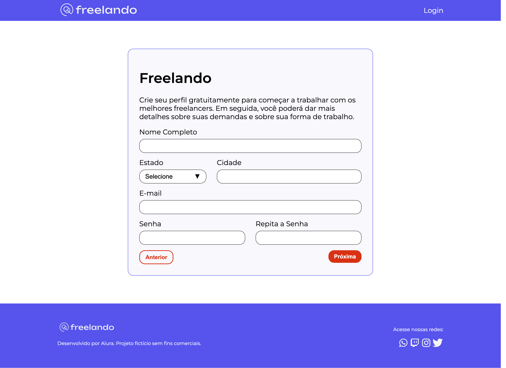

# Freelando

O Freelando é uma StartUP que estou desenvolvendo, iniciando como um MVP e constantemente recebendo novas funcionalidades.

## 🔨 Funcionalidades do projeto

Nesta etapa inicial, a entrega inicial do meu time de desenvolvimento é uma página base que serve como ponto de partida para o projeto.

[Confira o Figma da aplicação](https://www.figma.com/file/DGIzbfXEi27oiKzI0nGMIV/Freelando-%7C-WebApp-com-React?node-id=244%3A11524&t=J2NfqHrvVIr0jsgs-0).

## ✔️ Técnicas e tecnologias utilizadas

Durante o desenvolvimento, explorei diversas técnicas e tecnologias essenciais, incluindo:

- `React`
- `Vite`
- `Emotion`
- `React Grid System`
- `Eventos do Teclado`
- `GitHub`
- `Trello`
- `Figma`

E muito mais!

## 🛠️ Abrir e rodar o projeto

Para iniciar o projeto, é importante ter o ambiente configurado com Vite. Após isso, siga os passos abaixo:

1. Execute `npm i` para instalar as dependências.
2. Inicie o projeto com `npm run dev`.
3. Acesse o projeto através de [http://localhost:5173/](http://localhost:5173/) no seu navegador.

Para utilizar este projeto, será necessário baixar o seguinte projeto de backend: [freelando-back](https://github.com/bcocheto/freelando-back).
Após o download, siga estas etapas no backend:

1. Execute `npm i` para instalar as dependências.
2. Inicie o backend com `npm run start`.
3. Acesse [http://localhost:8080/api](http://localhost:8080/api) para explorar o swagger da aplicação.

Certifique-se de manter ambos os projetos (frontend e backend) em execução para aproveitar ao máximo as funcionalidades oferecidas pelo Freelando.
